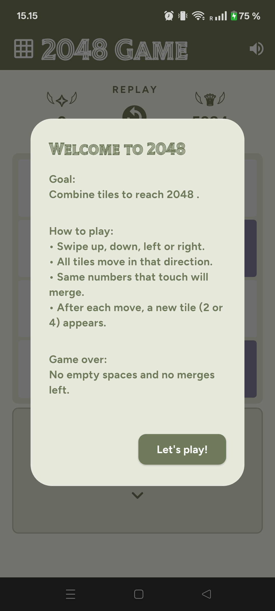
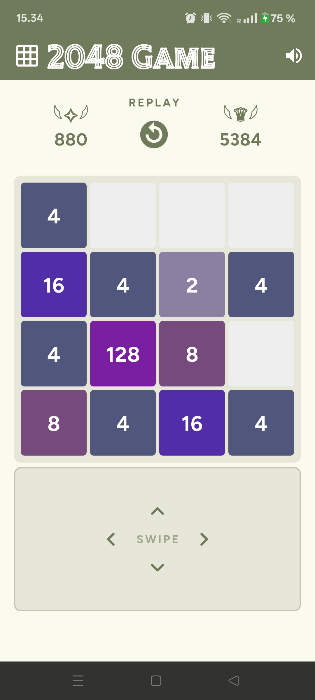
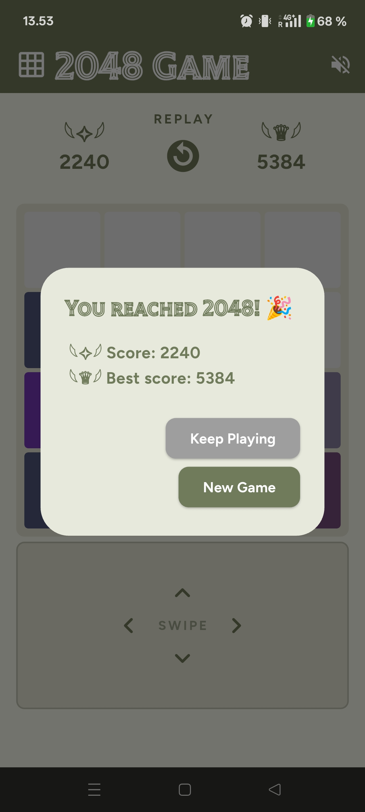
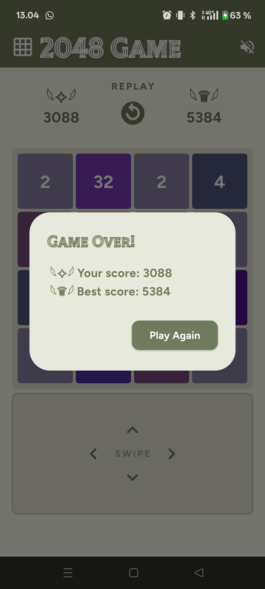

# 2048 Game 🎮

A Flutter implementation of the classic 2048 puzzle game, built with smooth animations, sound effects, and best score tracking.

## Overview

Slide and merge tiles to reach the **2048 tile**. Every swipe moves all tiles in one direction — matching numbers merge into one. The game ends when no moves are left.

## Features

- 👆 Swipe gestures + on-screen swipe pad
- 🔢 Score tracking with best score saved locally
- 🎵 Background music with win and game over sound effects
- 🔇 Mute / unmute toggle
- 💥 Smooth tile slide and merge animations
- 🎉 Welcome, win, and game over dialogs
- 🔄 Restart at any time

## 📱 Screenshots

| Welcome screen | Game State | Win screen | Gameover Screen |
| ---------- | ---------------- | --------- | --------- | 
|  |  |  |   |   

## Tech Stack

| | |
|---|---|
| Flutter | 3.41.4 |
| Dart | 3.11.1 |
| shared_preferences | ^2.5.4 |
| google_fonts | ^8.0.2 |
| audioplayers | ^6.6.0 |

## How to Run

1. Clone the repository
```
git clone https://github.com/mareerray/twenty-forty-eight.git
cd twenty_forty_eight
```

2. Install dependencies
```dart
flutter pub get
```

3. Run the app
```dart
flutter run
```

Tested on a physical Android device.

## How to Play
- Swipe up, down, left, or right to move all tiles

- Tiles with the same number merge into one

- After each move, a new tile (2 or 4) appears

- Reach 2048 to win — or keep going for a higher score!

- Game over when the board is full and no merges are possible

## Project Structure
```dart
lib/
├── main.dart                        ← App entry point, theme setup
├── game_screen.dart                 ← Main screen: state, swipe logic, game lifecycle
├── game_model.dart                  ← Game data: grid, score, move logic, best score
├── game_state.dart                  ← Enum: playing, moving, addingTile, gameOver
├── services/
│   └── audio_service.dart           ← Background music, sound effects, mute toggle
└── widgets/
    ├── tile_data.dart               ← Tile colors mapped to each tile value
    ├── game_ui.dart                 ← Full UI: AppBar, HUD, grid, swipe pad
    └── game_dialogs.dart            ← Welcome, win, and game over dialogs (mixin)
```
## Known Limitations
- Portrait mode only

- No undo feature

- No dark / light theme toggle

## Author
[Mayuree Reunsati](https://github.com/mareerray)
March 2026